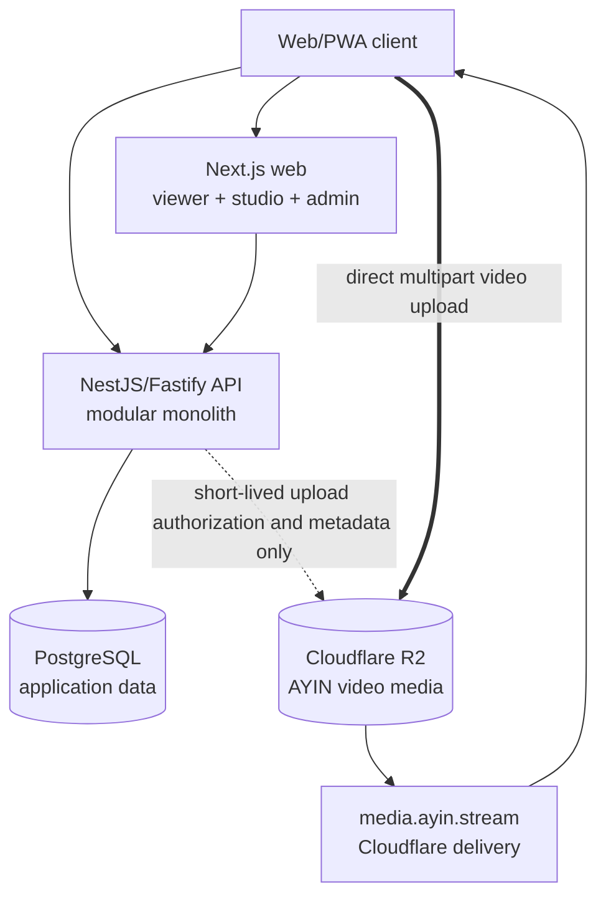
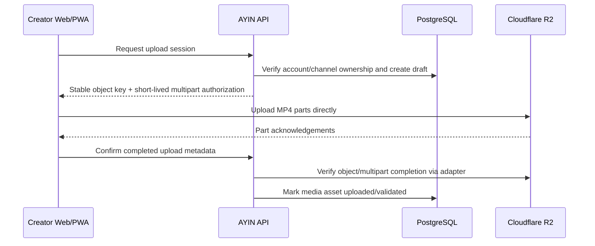

# AYIN Architecture

Status: Implemented architecture contract through Task 38
Last updated: 2026-08-30

This document is the engineering contract implemented by the current AYIN repository. The
initial Task 00 invariants remain authoritative; Tasks 01–38 added the application, domain,
provider-adapter, deployment, and platform-shell layers without changing the core boundaries.

## 1. Architectural invariants

The following rules are non-negotiable unless a later, explicit ADR supersedes them without contradicting the product plan:

- AYIN is a global product. Geography may be an optional discovery, rights, advertising, or compliance signal, but no country is the product identity or default assumption.
- The responsive Web/PWA is the source of truth for product UI and behavior.
- TypeScript is used throughout the application and shared packages.
- The repository is a pnpm workspace monorepo.
- `apps/web` is a current-stable Next.js application using the App Router.
- `apps/api` is a structured NestJS application using the Fastify adapter.
- PostgreSQL is the transactional system of record and Prisma is its ORM and migration tool.
- Zod validates untrusted runtime data and shared contracts where it adds value. TypeScript types alone are not treated as runtime validation.
- The backend is a modular monolith. Module boundaries are explicit, but the platform does not begin as microservices.
- Cloudflare R2 is the only object storage for AYIN creator video media.
- Creator video bytes travel **Creator browser -> Cloudflare R2 directly**. They never pass through, buffer on, or persist on the Next.js application, NestJS API, AWS EC2, EBS, or CloudPanel-managed filesystem.
- AWS EC2/CloudPanel may host the web application, API, PostgreSQL, and supporting application processes, but never creator video objects.
- Admin and Creator Studio initially live in isolated routes and modules inside `apps/web`, sharing one deployment with the viewer application.
- PWA capabilities and 10-foot/TV focus navigation are first-class architectural concerns.
- Every external service is accessed through an AYIN-owned adapter contract. Provider SDK types must not leak into domain logic.
- In-player video advertising and outside-player display/native advertising are separate inventory families, with separate placement and rendering paths.

## 2. Repository topology

The implemented structure follows this topology. New packages are added only when ownership is
clear and code is genuinely shared.

```text
ayin/
├── apps/
│   ├── web/                 # Viewer Web/PWA, Creator Studio and Admin route groups
│   └── api/                 # NestJS/Fastify modular application API
├── packages/
│   ├── ui/                  # Shared presentation primitives and TV-focus primitives
│   ├── config/              # Typed configuration helpers and schemas
│   ├── db/                  # Prisma schema, generated client and migrations
│   ├── types/               # Truly cross-application contracts/types
│   ├── auth/                # Shared auth contracts/helpers when justified
│   ├── media/               # Media contracts and provider-neutral primitives
│   ├── ads/                 # Advertising contracts and inventory primitives
│   └── analytics/           # Event contracts when introduced
├── docs/
└── infra/                   # Repeatable deployment/infrastructure definitions later
```

Packages are not a reason to fragment the domain prematurely. A package is introduced only for code that is genuinely shared, independently testable, or a clear infrastructure boundary. Applications must not import from one another; they communicate through typed HTTP/API contracts or shared packages.

## 3. Runtime topology



### Hosting responsibilities

| Runtime concern | Initial home | Boundary |
| --- | --- | --- |
| Viewer, Studio and Admin UI | Next.js on AWS EC2 via CloudPanel | One deployment, isolated route groups/modules |
| Application API and domain rules | NestJS/Fastify on AWS EC2 via CloudPanel | One modular monolith |
| Transactional application data | PostgreSQL on the application infrastructure | Metadata only; no video binary/blob columns |
| Creator video objects and related media assets | Cloudflare R2 | Only AYIN creator video object store |
| Media delivery | `media.ayin.stream` through Cloudflare | Range-capable delivery; application servers do not proxy playback |
| Future background jobs | Same modular application boundary initially | May run as a separate process, but not a separate service/domain by default |

CloudPanel is the server operations and reverse-proxy layer, not a product control plane. Product configuration belongs in authorized Admin modules and typed platform settings.

## 4. Product and service domains

The modules below describe ownership, not separate deployments.

| Domain module | Owns | Important boundaries |
| --- | --- | --- |
| Identity & Access | Registration, login, sessions/tokens, account roles | Authentication and authorization are enforced server-side |
| Accounts & Profiles | Account lifecycle and viewer profiles | A default viewer profile is created in registration provisioning |
| Channels | Public creator identity, handles, membership, channel settings | Stable IDs back relationships; handles remain mutable |
| Catalog & Video | Video metadata, state, rights linkage, categories, series/episode-ready model | Video bytes are never stored in PostgreSQL or application filesystems |
| Media & Uploads | Draft/upload sessions, R2 keys, multipart state, media asset metadata | R2 provider is behind an adapter; API signs/authorizes but never proxies video bytes |
| Playlists | System Uploads playlist, user playlists, ordering | System playlists have explicit protected semantics |
| Creator TV | Automatic TV entity, eligibility, rotation and schedules | V1 is application-level scheduling over playback-ready MP4, not true live/FAST ingest |
| Viewing | Watch progress, history, My AYIN state and playback authorization | Profile isolation and efficient progress writes |
| Discovery & Search | Home rows, recommendations, search and merchandising queries | Global-neutral defaults; regional rows only when deliberately configured |
| Social | Subscriptions, reactions, comments, saves and reports | Ownership, moderation and rate limits are server enforced |
| Creator Studio | Creator library, analytics, TV and channel management UI | Web route/module; it consumes API contracts and does not own domain persistence |
| Admin Control Plane | Users, content, settings, homepage, TV, moderation and operational controls | Independent authorization, audit logs and safe configuration schemas |
| Video Advertising | In-player pre/mid/post decisions, VAST/IMA integration and ad playback events | Separate inventory family; provider-neutral `VideoAdService` boundary |
| Page Advertising | Outside-player display/native placement definitions and rendering | Separate inventory family; provider-neutral page-ad adapter boundary |
| Direct Campaigns | Advertisers, campaigns, creatives, targeting, pacing baseline | Can supply either inventory family without merging their placement models |
| Monetization | Creator contracts, attribution, ledger and payout readiness | Configurable terms; decimal-safe money and append-only adjustments |
| Analytics | Versioned product, playback, upload, TV and ad events | Validated, privacy-aware events; noisy client activity is batched/throttled |
| Moderation & Rights | Rights declarations, reports, cases, strikes and appeals | Destructive actions are audited and recoverable where practical |
| Notifications | In-app notifications and future delivery-provider orchestration | Email/push providers remain adapters |
| Platform Configuration | Typed settings, feature flags and admin-controlled defaults | Secrets remain environment configuration, never ordinary database settings |

### Boundary rules

- `apps/api` owns domain invariants, authorization, transactions, and authoritative mutations.
- `apps/web` owns presentation, PWA behavior, browser capability checks, TV focus behavior, and view-specific orchestration. It must not import Prisma or bypass API authorization for domain mutations.
- `packages/db` is the only home for the Prisma schema, migrations, and Prisma client construction.
- Shared packages expose narrow public entry points. Deep imports into another module's internals are prohibited.
- Cross-domain operations are coordinated by application services inside the modular monolith, not by duplicating data or introducing network calls between modules.
- Retryable/asynchronous operations use stable idempotency keys and explicit state transitions.
- Admin visibility in the UI never substitutes for server-side admin authorization.

## 5. Critical data flows

### 5.1 Registration and automatic creator provisioning

Successful registration executes one PostgreSQL transaction. It creates at minimum:

1. Account.
2. Default viewer profile.
3. Public creator channel and unique handle.
4. Protected system playlist named `Uploads` by the current configured default.
5. Creator TV named from the channel, initially `{Channel Name} TV` by the current configured template.
6. Default channel/settings, monetization eligibility/contract baseline, notification preferences, and analytics configuration required by the implemented schema.

The transaction is atomic and idempotent/recoverable. A successful account must not exist without its default profile, channel, Uploads playlist, and Creator TV. There is no separate “become a creator” or setup wizard.

### 5.2 Direct Creator -> R2 upload



Hard media rule: the `C -> R` request contains the video bytes. Requests to `A` contain only authorization, ownership, state, and metadata. The API and web server must reject any implementation that buffers or proxies creator video bodies.

V1 accepts playback-ready MP4. Browser checks provide fast feedback, while the server remains authoritative for allowed size/type/state. No transcoding pipeline is implied by this architecture.

### 5.3 Publish and automatic distribution

After upload completion, publishing performs one authoritative transaction or equivalent idempotent unit of work:

1. Verify the authenticated creator owns the channel and draft.
2. Verify the R2 upload is complete and accepted.
3. Record the rights declaration version and timestamp.
4. Move the video to its requested publish state.
5. Add it exactly once to the channel's protected Uploads playlist.
6. Add it exactly once to Creator TV eligibility/rotation when current platform and channel settings allow.

Publishing must remain usable through the minimal `Choose video -> Upload -> Publish` path. Optional metadata does not become a hidden prerequisite.

### 5.4 Playback

1. The viewer requests catalog/detail data from the API.
2. The API returns authorized metadata and a media delivery reference, not video bytes.
3. The player requests the MP4 from `media.ayin.stream`/R2 with HTTP range support.
4. Playback progress and analytics events go to the API using throttled/batched contracts.
5. Creator TV uses the same R2-hosted MP4 assets and a deterministic application schedule in V1.

### 5.5 Advertising inventory families

AYIN models two explicitly separate inventory families:

| Inventory family | Surface and formats | Initial adapter direction | Placement identity |
| --- | --- | --- | --- |
| In-player video | Pre-roll, mid-roll, post-roll inside AYIN Player | House/direct VAST and Google IMA/Google Ad Manager-ready video adapter | Video break/placement keys with content, channel and session attribution |
| Outside-player display/native | Home, between rows/results, below player, content/channel/TV pages, responsive side placements | House/direct and Google Publisher Tag-ready page adapter | Page placement keys with route, device and audience context |

The families may share campaign administration, consent signals, frequency policy, and event reporting, but they do not share UI components, raw provider tags, or placement definitions. An in-player ad failure must not block content playback; a page ad no-fill must collapse cleanly.

## 6. Web, Studio, Admin, PWA and TV composition

`apps/web` initially contains three isolated route/module areas:

- Viewer/public application: `/`, catalog, watch, channel, TV, search, and My AYIN surfaces.
- Creator Studio: `/studio/...` with creator-scoped navigation, guards, and bundles.
- Admin: `/admin/...` with independently enforced admin guards, audit-aware actions, and bundles.

`studio.ayin.stream` and `admin.ayin.stream` may later reverse proxy or redirect to these same route areas without requiring separate applications. Separation into different deployments is permitted later only when operational evidence justifies it; domain APIs remain stable.

The web design system must support pointer, keyboard, touch, and directional remote input. Focus ownership, focus restoration, spatial navigation, reduced motion, and 10-foot sizing are shared primitives rather than page-specific patches. PWA lifecycle, manifest, deep links, and safe service-worker behavior are designed from the start; creator video libraries are never indiscriminately cached offline.

## 7. External provider adapters

Domain/application code depends on AYIN contracts; infrastructure code implements those contracts. Initial or anticipated adapters include:

- Cloudflare R2 object storage/upload authorization.
- Google and other identity providers.
- Email and future push delivery.
- In-player video advertising providers, beginning with a Google IMA-ready adapter when configured.
- Outside-player display/native providers, including a Google Publisher Tag-ready adapter when configured.
- Direct/house advertising.
- Analytics export or observability providers.
- Future live ingest, linear output, transcoding, payments, or semantic-search providers.

Provider credentials are loaded only from validated server-side environment configuration. Development adapters must identify themselves honestly and must never report a production provider as connected when it is not.

## 8. Data ownership and storage

| Data class | Authoritative store | Notes |
| --- | --- | --- |
| Accounts, profiles, channels, metadata, settings, schedules, social state, ad metadata, ledgers | PostgreSQL | Accessed through the API/domain layer |
| Creator source MP4 and future video renditions | Cloudflare R2 only | No AWS/EBS copy, proxy, staging file, or database blob |
| Thumbnails, captions and channel/media assets | Cloudflare R2 through the media adapter | Namespaced separately from source video objects |
| Secrets | Deployment secret/environment configuration | Never committed or exposed as ordinary admin settings |
| Build output and server logs | Application infrastructure | Must not contain video request bodies or credentials |

PostgreSQL backup/restore validation and R2 lifecycle/retention are production operational gates
documented in `deploy/README.md`, `docs/SECURITY_HARDENING.md`, and
`docs/LAUNCH_CHECKLIST.md`. Any production configuration must preserve encryption, access
controls, tested restore ownership, and the rule that application servers do not become creator
video storage.

## 9. Security and reliability baseline

- Validate untrusted data server-side; use Zod for shared/runtime boundaries where useful and framework validation consistently inside the API.
- Authorize account, profile, channel, creator, and admin actions on the server using stable IDs derived from authenticated context.
- Use short-lived, least-privilege R2 upload authorization and server-generated object keys.
- Apply rate limits to authentication, comments, search, reports, and upload-session operations as each module is introduced.
- Use database transactions for registration provisioning and other multi-record invariants.
- Audit high-impact admin and moderation actions.
- Keep secrets out of source control, logs, client bundles, and persisted ordinary settings.
- Preserve the implemented health checks, idempotency boundaries, deployment rollback, and
  abandoned-upload cleanup; verify backups, alerts, and edge behavior in the target environment.

## 10. Evolution rules

- Start with playback-ready MP4; do not add transcoding, HLS, live, or SSAI infrastructure before its roadmap task and a real operational need.
- A queue, worker process, or scheduled job does not by itself justify a microservice. Keep it in the modular application boundary first.
- Split a module into a service only after measurable scaling, isolation, ownership, or deployment needs outweigh the operational cost.
- Keep provider adapters replaceable and preserve AYIN-owned contracts so Google, Cloudflare, or future providers do not define core domain models.
- Every architectural change that alters these invariants requires a new ADR in `docs/DECISIONS.md`.
