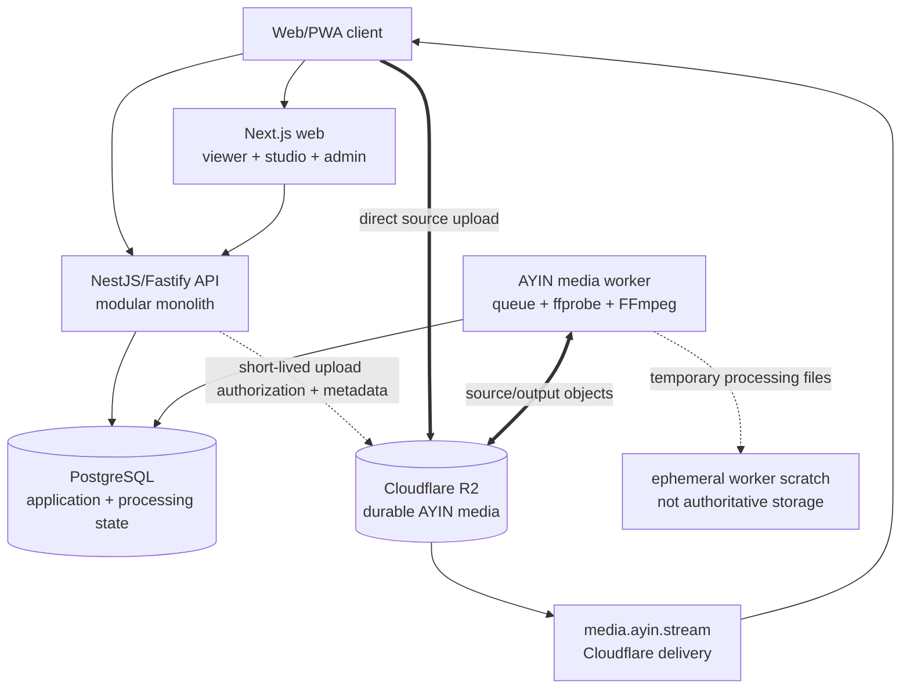
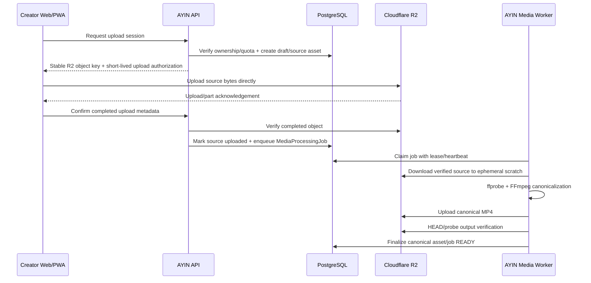

# AYIN Architecture

Status: Implemented architecture contract through Task 39  
Last updated: 2026-09-07

This document is the engineering contract implemented by the current AYIN repository. The initial Task 00 invariants remain authoritative except where a later explicit ADR records an intentional evolution. Current code is authoritative when a historical task document describes behavior that has since evolved. Media evolution is governed by ADR-015 and `docs/MEDIA_ARCHITECTURE_V2.md`.

## 1. Architectural invariants

The following rules are non-negotiable unless a later explicit ADR supersedes them without contradicting the product plan:

- AYIN is a global product. Geography may be an optional discovery, rights, advertising, or compliance signal, but no country is the product identity or default assumption.
- The responsive Web/PWA is the source of truth for product UI and behavior.
- TypeScript is used throughout the application and shared packages.
- The repository is a pnpm workspace monorepo.
- `apps/web` is a current-stable Next.js application using the App Router.
- `apps/api` is a structured NestJS application using the Fastify adapter.
- PostgreSQL is the transactional system of record and Prisma is its ORM and migration tool.
- Zod validates untrusted runtime data and shared contracts where it adds value. TypeScript types alone are not treated as runtime validation.
- The backend is a modular monolith. Module boundaries are explicit; background workers may run as separate processes while remaining in the same application/domain boundary.
- Cloudflare R2 is the only durable object storage for AYIN creator video media.
- Creator upload request bodies travel **Creator browser -> Cloudflare R2 directly**. Web/API request handlers do not proxy creator video upload bytes.
- The media worker may download source media from R2 into bounded ephemeral local scratch space for probe/transcode/package work. That scratch space is never authoritative/durable creator-media storage and is cleaned after processing.
- AYIN already has a database-backed media processing queue, dedicated worker process, `ffprobe`, FFmpeg canonicalization, R2 output upload and verification, retries, leases and stale-job recovery.
- The current production playback artifact is a canonical H.264/AAC `yuv420p` fast-start MP4 served through `media.ayin.stream`.
- Task 39 introduces contracts/schema for HLS adaptive bitrate streaming while retaining the canonical MP4 fallback. Task 39 does not generate HLS and does not switch production playback.
- Admin and Creator Studio initially live in isolated routes and modules inside `apps/web`, sharing one deployment with the viewer application.
- PWA capabilities and 10-foot/TV focus navigation are first-class architectural concerns.
- Every external service is accessed through an AYIN-owned adapter contract. Provider SDK types must not leak into domain logic.
- In-player video advertising and outside-player display/native advertising are separate inventory families, with separate placement and rendering paths.

## 2. Repository topology

The implemented structure follows this topology. New packages are added only when ownership is clear and code is genuinely shared.

```text
ayin/
├── apps/
│   ├── web/                 # Viewer Web/PWA, Creator Studio and Admin route groups
│   └── api/                 # NestJS/Fastify modular application API + media worker entrypoint
├── packages/
│   ├── ui/                  # Shared presentation primitives and TV-focus primitives
│   ├── config/              # Typed configuration helpers and schemas
│   ├── db/                  # Prisma schema, generated client and migrations
│   ├── types/               # Truly cross-application contracts/types
│   ├── auth/                # Shared auth contracts/helpers when justified
│   ├── media/               # Media contracts/provider-neutral primitives when shared
│   ├── ads/                 # Advertising contracts and inventory primitives
│   └── analytics/           # Event contracts when introduced
├── docs/
└── infra/                   # Repeatable deployment/infrastructure definitions where required
```

Packages are not a reason to fragment the domain prematurely. Applications must not import from one another; they communicate through typed HTTP/API contracts or shared packages.

## 3. Runtime topology



### Hosting responsibilities

| Runtime concern | Initial home | Boundary |
| --- | --- | --- |
| Viewer, Studio and Admin UI | Next.js on AWS EC2 via CloudPanel | One deployment, isolated route groups/modules |
| Application API and domain rules | NestJS/Fastify on AWS EC2 via CloudPanel | One modular monolith |
| Media processing worker | Separate process using the same API/media code boundary | Claims durable DB jobs; performs probe/FFmpeg/R2 operations; no independent service API |
| Transactional/application/processing state | PostgreSQL | Metadata/lifecycle only; no video binary/blob columns |
| Durable creator video objects and related assets | Cloudflare R2 | Only durable AYIN creator-video object store |
| Worker processing scratch | Local ephemeral filesystem | Temporary, bounded, non-authoritative, cleaned after processing |
| Media delivery | `media.ayin.stream` through Cloudflare | Range-capable delivery; application API does not proxy playback |

CloudPanel is the server operations and reverse-proxy layer, not a product control plane. Product configuration belongs in authorized Admin modules and typed platform settings.

## 4. Product and service domains

The modules below describe ownership, not separate deployments.

| Domain module | Owns | Important boundaries |
| --- | --- | --- |
| Identity & Access | Registration, login, sessions/tokens, account roles | Authentication/authorization server-side |
| Accounts & Profiles | Account lifecycle and viewer profiles | Default viewer profile provisioned automatically |
| Channels | Public creator identity, handles, membership, channel settings | Stable IDs back relationships |
| Catalog & Video | Video metadata, state, rights linkage, categories, series/episode-ready model | Video bytes never stored in PostgreSQL |
| Media & Uploads | Direct-R2 upload sessions, media assets, processing queue/lifecycle, canonical MP4 and V2 distribution contracts | Upload bodies bypass API; worker processing stays inside media boundary; durable media remains R2 |
| Playlists | System Uploads playlist, user playlists, ordering | System playlists have explicit protected semantics |
| Creator TV | Automatic TV entity, eligibility, rotation and schedules | Current Creator TV schedules canonical on-demand assets; not equivalent to live ingest/transcoding |
| Viewing | Watch progress, history, My AYIN state and playback authorization | Current public playback contract remains canonical MP4 in Task 39 |
| Discovery & Search | Home rows, recommendations, search and merchandising queries | Global-neutral defaults |
| Social | Subscriptions, reactions, comments, saves and reports | Ownership/moderation/rate limits server enforced |
| Creator Studio | Creator library, analytics, TV and channel management UI | Web route/module consuming API contracts |
| Admin Control Plane | Users, content, settings, homepage, TV, moderation and operational controls | Independent authorization/audit |
| Video Advertising | In-player pre/mid/post decisions, VAST/IMA integration and ad playback events | Separate inventory family |
| Page Advertising | Outside-player display/native placements | Separate inventory family |
| Direct Campaigns | Advertisers, campaigns, creatives, targeting and pacing baseline | Can supply either inventory family |
| Monetization | Creator contracts, attribution, ledger and payout readiness | Decimal-safe, auditable financial state |
| Analytics | Versioned product, playback, upload, TV and ad events | Validated/privacy-aware events |
| Moderation & Rights | Rights declarations, reports, cases, strikes and appeals | Destructive actions audited/recoverable where practical |
| Notifications | In-app notifications and future delivery-provider orchestration | Delivery providers remain adapters |
| Platform Configuration | Typed settings, feature flags and admin-controlled defaults | Secrets stay in environment configuration |

### Boundary rules

- `apps/api` owns domain invariants, authorization, transactions, authoritative mutations and the media worker entrypoint/services.
- `apps/web` owns presentation, PWA behavior, browser capability checks, TV focus behavior and view-specific orchestration. It must not import Prisma or bypass API authorization for domain mutations.
- `packages/db` is the only home for the Prisma schema, migrations and Prisma client construction.
- Shared packages expose narrow public entry points. Deep imports into another module's internals are prohibited.
- Cross-domain operations are coordinated by application services inside the modular monolith, not by introducing network calls between modules.
- Retryable/asynchronous operations use stable idempotency keys, deterministic namespaces and explicit state transitions.
- Admin visibility in the UI never substitutes for server-side admin authorization.

## 5. Critical data flows

### 5.1 Registration and automatic creator provisioning

Successful registration executes one PostgreSQL transaction. It creates at minimum:

1. Account.
2. Default viewer profile.
3. Public creator channel and unique handle.
4. Protected system playlist named `Uploads` by the current configured default.
5. Creator TV named from the channel, initially `{Channel Name} TV` by the current configured template.
6. Default channel/settings, monetization eligibility/contract baseline, notification preferences and analytics configuration required by the implemented schema.

The transaction is atomic and idempotent/recoverable. There is no separate “become a creator” or setup wizard.

### 5.2 Direct Creator -> R2 upload and canonical processing



Hard upload rule: the browser `C -> R` request contains creator upload bytes. Requests to `A` contain authorization, ownership, state and metadata. The API/web request path must reject implementations that proxy or buffer creator upload bodies.

The worker is a different boundary: it intentionally performs R2-to-scratch-to-R2 processing. Current FFmpeg output is H.264/AAC `yuv420p`, fast-start MP4, capped without upscaling. The deterministic canonical key is:

```text
channels/{channelId}/videos/{videoId}/playback/g{generation}.mp4
```

The queue/worker already supports claims, leases, heartbeats, bounded retry/backoff, stale-lease recovery and recovery from an already-produced output after verification.

### 5.3 Task 39 adaptive media V2 contract

Task 39 prepares but does not activate adaptive streaming. The desired future flow is:

```text
verified source/canonical input
-> canonical fallback MP4
-> justified 360p/480p/720p/1080p H.264/AAC renditions
-> HLS packaging
-> master manifest
-> R2/media.ayin.stream
-> AYIN Player adaptive selection with MP4 fallback
```

Initial adaptive rules:

- never upscale;
- plan only rungs at or below normalized source display height;
- preserve aspect ratio/even encoded dimensions;
- H.264 + AAC + `yuv420p` initially;
- HLS MPEG-TS segments initially;
- no 1440p/4K production output yet;
- fallback MP4 remains mandatory;
- object keys are deterministic per video/generation/rendition;
- partial output is never adaptive `READY`;
- retries reuse the same generation/namespace; explicit reprocess creates a new generation.

V2 adaptive keys extend the existing namespace:

```text
channels/{channelId}/videos/{videoId}/playback/g{generation}/hls/master.m3u8
channels/{channelId}/videos/{videoId}/playback/g{generation}/hls/{rendition}/index.m3u8
channels/{channelId}/videos/{videoId}/playback/g{generation}/hls/{rendition}/segment-000001.ts
```

See `docs/MEDIA_ARCHITECTURE_V2.md` for the detailed ladder/readiness/storage contract.

### 5.4 Publish and automatic distribution

Publishing remains gated by the current canonical MP4 in Task 39:

1. Verify the authenticated creator owns the channel and draft.
2. Verify upload/processing state and require a validated `video/mp4` canonical asset.
3. Record the rights declaration version and timestamp.
4. Move the video to its requested publish state.
5. Add it exactly once to the protected Uploads playlist.
6. Add it exactly once to Creator TV eligibility/rotation when settings allow.

A failed or still-running media job does not satisfy publish readiness.

### 5.5 Playback

Current production behavior remains unchanged in Task 39:

1. The viewer requests catalog/detail data from the API.
2. `WatchService` selects a validated canonical MP4 and returns one source reference.
3. AYIN Player requests that MP4 from `media.ayin.stream`/R2 with HTTP range support.
4. Playback progress and analytics events go to the API using throttled/batched contracts.
5. Creator TV uses the same canonical assets.

Future adaptive selection must be a separate rollout step. HLS object existence alone cannot change playback; selection must require a ready V2 generation and retain fallback to canonical MP4.

### 5.6 Advertising inventory families

AYIN models two explicitly separate inventory families:

| Inventory family | Surface and formats | Initial adapter direction | Placement identity |
| --- | --- | --- | --- |
| In-player video | Pre-roll, mid-roll, post-roll inside AYIN Player | House/direct VAST and Google IMA/Google Ad Manager-ready video adapter | Video break/placement keys with content, channel and session attribution |
| Outside-player display/native | Home, between rows/results, below player, content/channel/TV pages, responsive side placements | House/direct and Google Publisher Tag-ready page adapter | Page placement keys with route, device and audience context |

The families may share campaign administration, consent signals, frequency policy and event reporting, but they do not share UI components, raw provider tags or placement definitions. An in-player ad failure must not block content playback; a page ad no-fill must collapse cleanly.

## 6. Web, Studio, Admin, PWA and TV composition

`apps/web` initially contains three isolated route/module areas:

- Viewer/public application: `/`, catalog, watch, channel, TV, search and My AYIN surfaces.
- Creator Studio: `/studio/...` with creator-scoped navigation, guards and bundles.
- Admin: `/admin/...` with independently enforced admin guards, audit-aware actions and bundles.

`studio.ayin.stream` and `admin.ayin.stream` may later reverse proxy or redirect to these same route areas without requiring separate applications. Separation into different deployments is permitted later only when operational evidence justifies it; domain APIs remain stable.

The web design system must support pointer, keyboard, touch and directional remote input. PWA lifecycle, manifest, deep links and safe service-worker behavior are designed from the start; creator video libraries are never indiscriminately cached offline.

## 7. External provider adapters

Domain/application code depends on AYIN contracts; infrastructure code implements those contracts. Initial or anticipated adapters include:

- Cloudflare R2 object storage/upload authorization and worker object operations.
- Google and other identity providers.
- Email and future push delivery.
- In-player video advertising providers, beginning with a Google IMA-ready adapter when configured.
- Outside-player display/native providers, including a Google Publisher Tag-ready adapter when configured.
- Direct/house advertising.
- Analytics export or observability providers.
- Future live ingest/linear output, payments or semantic-search providers.

FFmpeg processing is current internal application infrastructure, not an external provider service. A future external transcoding vendor would require an AYIN-owned adapter and a new architectural decision.

Provider credentials are loaded only from validated server-side environment configuration. Development adapters must identify themselves honestly and never report a production provider as connected when it is not.

## 8. Data ownership and storage

| Data class | Authoritative store | Notes |
| --- | --- | --- |
| Accounts, profiles, channels, metadata, settings, schedules, social state, ad metadata, ledgers, media-processing lifecycle | PostgreSQL | Metadata/state only; no video blobs |
| Creator source/canonical/adaptive media objects | Cloudflare R2 | Only durable creator-video object store |
| Worker input/output scratch | Ephemeral local filesystem | Temporary processing only; non-authoritative and cleaned |
| Thumbnails, captions and channel/media assets | Cloudflare R2 through media infrastructure | Namespaced separately/appropriately |
| Secrets | Deployment secret/environment configuration | Never ordinary admin settings/source control |
| Build output and server logs | Application infrastructure | Must not contain upload bodies or credentials |

PostgreSQL backup/restore validation and R2 lifecycle/retention are production operational gates documented in `deploy/README.md`, `docs/SECURITY_HARDENING.md`, and `docs/LAUNCH_CHECKLIST.md`.

## 9. Security and reliability baseline

- Validate untrusted data server-side; use Zod for shared/runtime boundaries where useful.
- Authorize account, profile, channel, creator and admin actions on the server using authenticated stable IDs.
- Use short-lived least-privilege R2 upload authorization and server-generated object keys.
- Application upload endpoints never accept/proxy creator video bodies.
- Worker scratch paths are bounded/ephemeral and are cleaned on success/failure; R2 remains authoritative media storage.
- Queue claims/retries use explicit leases/heartbeats and deterministic processing generations.
- Media readiness is a database lifecycle decision after verification, not a side effect of an object appearing in R2.
- Apply rate limits to sensitive endpoints as appropriate.
- Use database transactions for multi-record invariants.
- Audit high-impact admin/moderation actions.
- Keep secrets out of source control, logs, client bundles and ordinary persisted settings.
- Preserve health checks, deployment rollback and abandoned-upload cleanup; verify backups, alerts and edge behavior in the target environment.

## 10. Evolution rules

- Preserve the known-working canonical MP4 path while adaptive streaming is introduced incrementally.
- HLS/ABR generation, public playback metadata and player preference are separate rollout steps; do not combine them without an explicit task/ADR.
- Keep media processing inside the modular application/worker boundary until measured scaling, isolation, ownership or deployment needs justify a service split.
- A queue or separate worker process does not by itself justify a microservice.
- Keep provider adapters replaceable and preserve AYIN-owned contracts.
- Media reprocessing uses explicit generations; retries of a generation remain idempotent and recoverable.
- Every architectural change that alters these invariants requires a new ADR in `docs/DECISIONS.md`.
